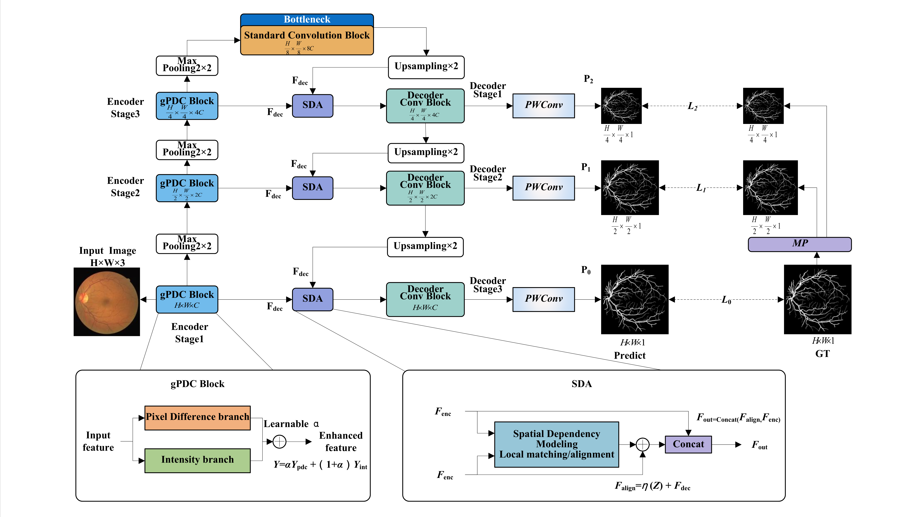

python eval_drive.py --models_dir ./models/drive --data_dir ./data/DRIVE --results_dir ./results/drive --lambda_list "0.2" --seeds "42"

python eval_stare.py --models_dir ./models/stare --data_dir ./data/STARE --results_dir ./results/stare --lambda_list "0.6" --seeds "42"

python eval_chase.py --models_dir ./models/chase --data_dir ./data/CHASEDB1 --results_dir ./results/chase --lambda_list "0.5" --seeds "42"

python .\eval_drive_chase_to_stare.py --seeds 20,42,80 --methods baseline,ours --ours_lambda_list 0.0

python .\eval_drive_stare_to_chase.py --seeds 40,42,80 --methods baseline,ours --ours_lambda_list 0.4 

python .\eval_stare_chase_to_drive.py --seeds 40,42,80 --methods baseline,ours --ours_lambda_list 0.0

python .\eval_sccd.py --models_dir .\models\sccd_filtered --results_dir .\results\sccd_filtered --seeds 20,42,101
